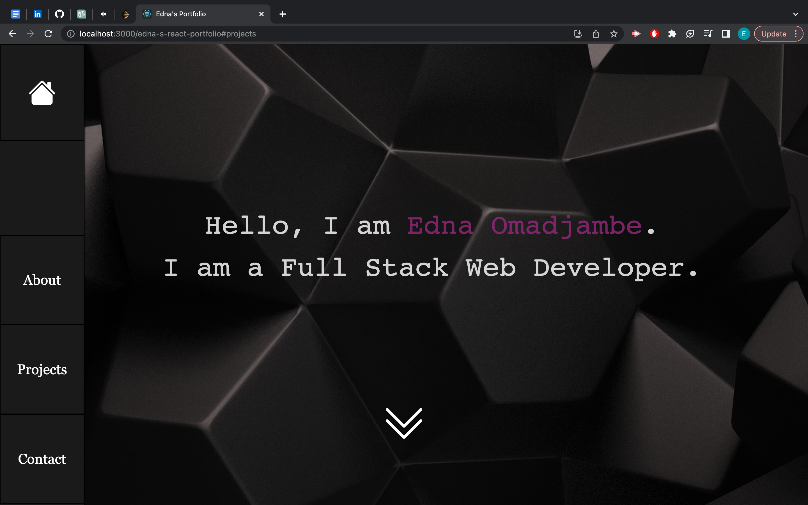
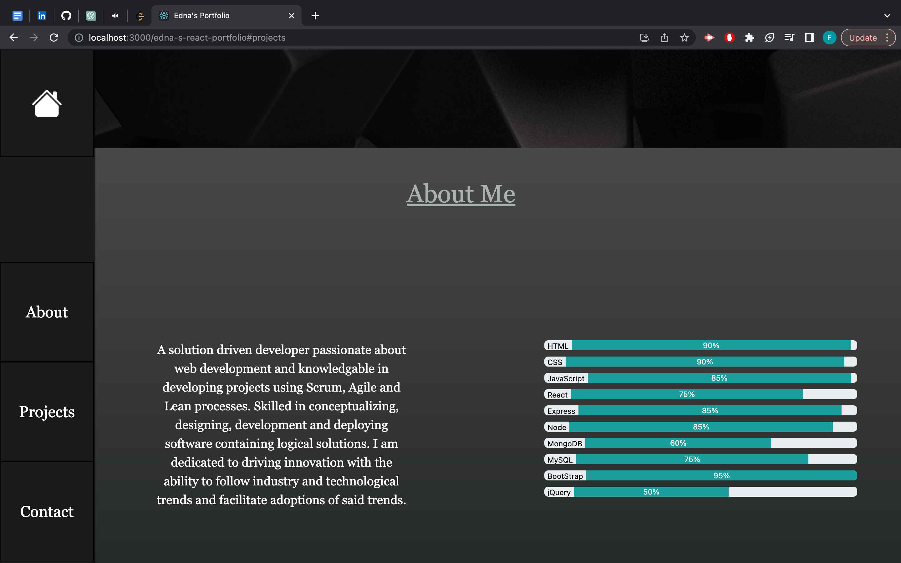
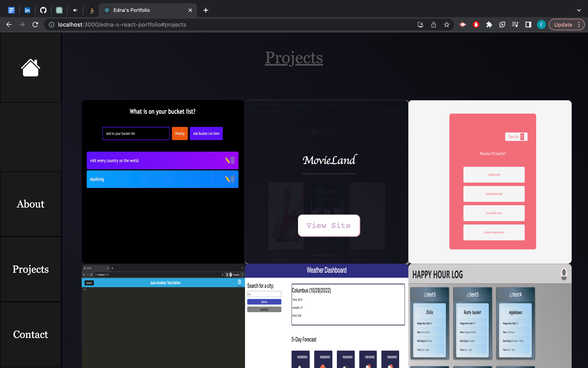

# edna-s-react-portfolio
 

## Description
The following code is for my portfolio built using ReactJS. The portfolio opens to a page with an image of myself as well as a section about me. There is a navbar with links to other pages with my portfolio, a contact form and my resume. The portfolio also includes a footer with links to my linkedIn, gmail and github. 

  ## Table of Contents

  - [Installation](#installation)
  - [Usage](#usage)
  - [Contributing](#contributing)
  - [License](#license)
  - [Tests](#tests)
  - [Future-Development](#future-development)

  ## Installation

  To install this project, download the files from my repository at https://github.com/Edna1999/edna-s-react-portfolio. Run an NPM install in the console to load in the correct packages, run an 'npm ' to start the application! Navigate to the local site at http://localhost:3000 to view the app.

  You can also visit the deployed webpage via the following link:  https://edna1999.github.io/edna-s-react-portfolio/
  
  ## Usage

  ## Contributing

  - [Edna Omadjambe](https://github.com/Edna1999)

  ## License
  The License being used is: MIT
  If you would like to read more on this please click the badge to navigate to the license page: 
  

  ## Tests

  No tests have been created yet for this project
